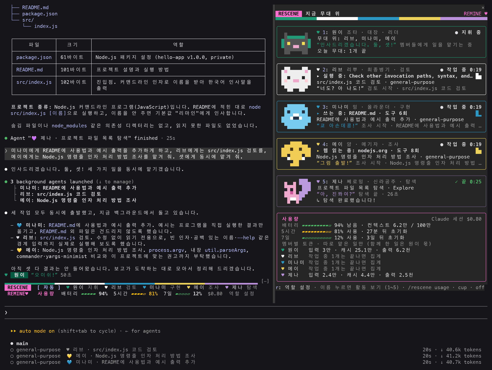
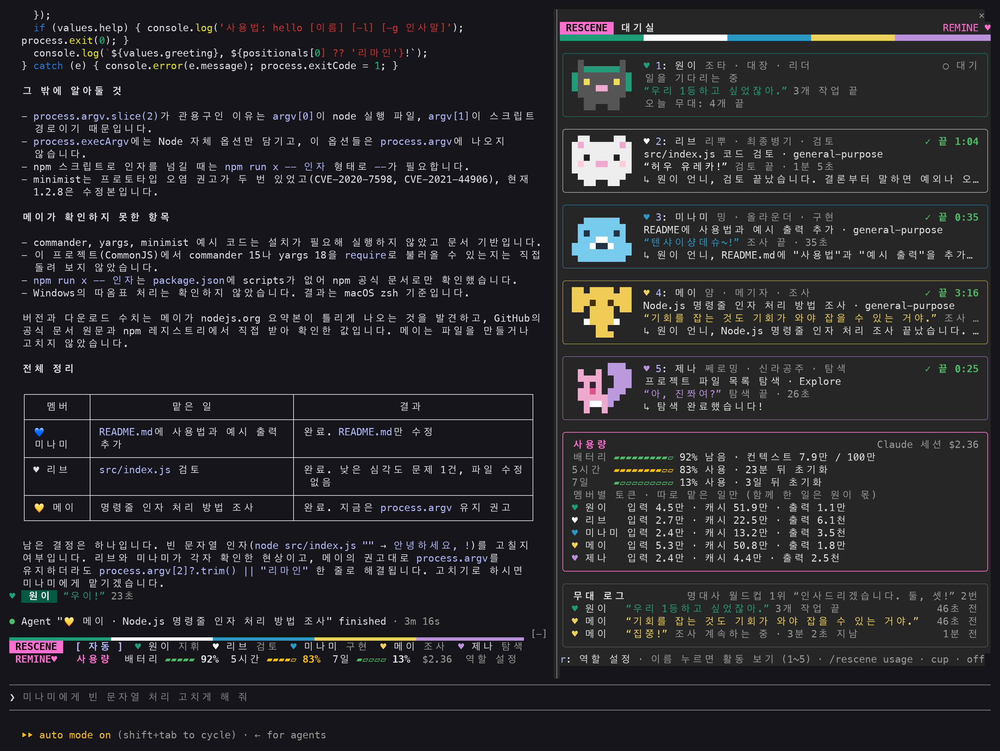
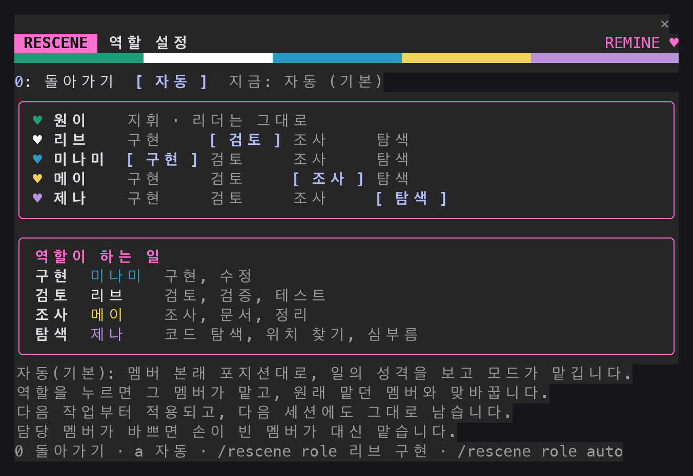
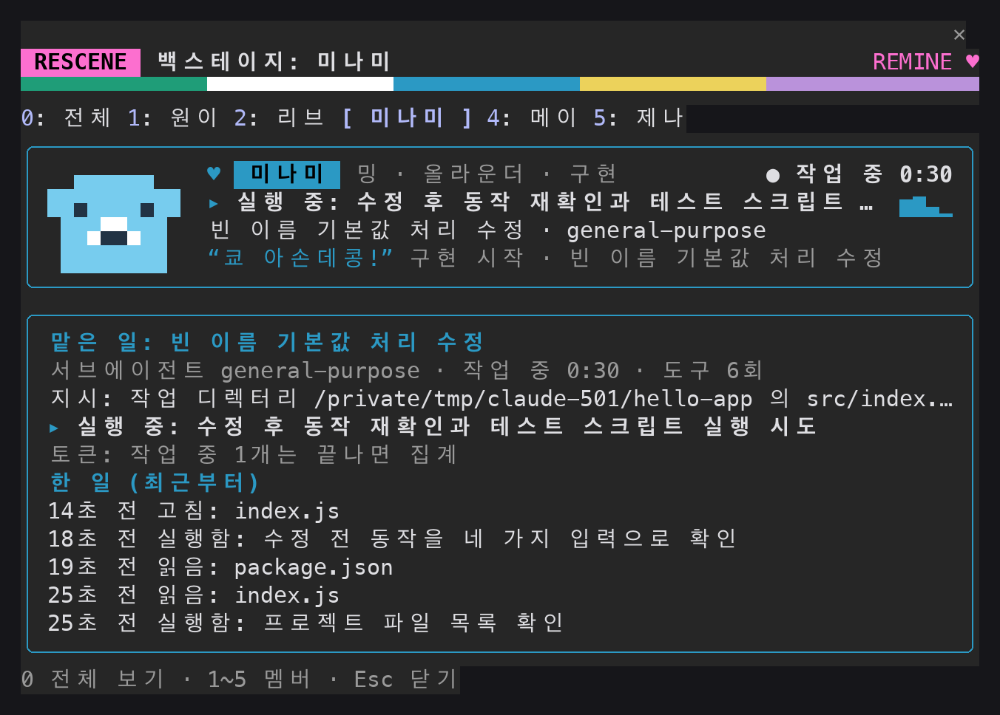
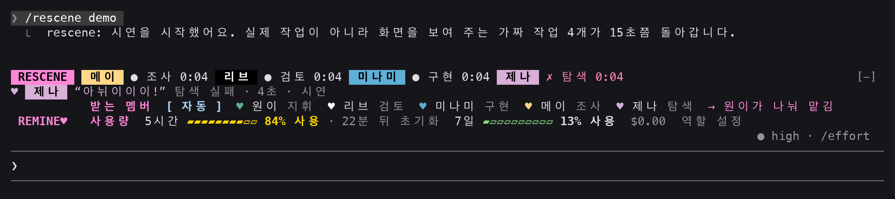

# rescene — 리센느 모드 for Claude Code

[English](README.md) · **한국어**

Claude Code 안에서 **리센느(RESCENE) 원이가 지휘하고, 리브·미나미·메이·제나가 일을 맡아 자기 말투로 보고하는** 모드(mod, 플러그인)입니다. 누가 지금 무슨 일을 하는지 멤버별 카드로 보여 줍니다. 리마인(리센느 팬)이 만든 비공식 팬 모드입니다. 한국어와 영어로 동작합니다(한국어 사용자에게는 한국어, 그 밖에는 영어). 버전 0.9.1.



원이에게 "미나미에게 README를 고치게 하고, 리브에게 코드 검토를, 메이에게 조사를 맡겨 줘"라고 하면 오른쪽 패널에서 세 멤버가 각자 일하는 모습이 보입니다. 다 끝나면 원이가 결과를 모아 보고합니다.



> 스크린샷은 실제 Claude Code 세션(예제 폴더 `hello-app`)의 터미널 출력을 글자와 색 그대로 그림으로 옮긴 것입니다. 글꼴과 색은 쓰는 터미널에 따라 조금 다르게 보일 수 있습니다.

## 목차

- [설치 (3분)](#설치-3분)
- [처음 써 보기](#처음-써-보기)
- [멤버와 역할](#멤버와-역할)
- [화면에 보이는 것](#화면에-보이는-것)
- [명령](#명령)
- [설정](#설정)
- [언어 (한국어·영어)](#언어-한국어영어)
- [문제가 생겼을 때](#문제가-생겼을-때)
- [이 모드가 컴퓨터에서 하는 일](#이-모드가-컴퓨터에서-하는-일)
- [AI에게 설치와 사용을 맡기려면](#ai에게-설치와-사용을-맡기려면)
- [Orca fleet-run 연동 (선택)](#orca-fleet-run-연동-선택)
- [개발](#개발)
- [알아 둘 점과 출처](#알아-둘-점과-출처)

## 설치 (3분)

### 준비물

- **Claude Code**: 터미널에서 `claude`로 실행하는 프로그램입니다. 아직 없다면 [Claude Code 소개 페이지](https://claude.com/claude-code)의 안내대로 먼저 설치하세요.
- 이 모드는 Claude Code 2.1.291에서 만들고 시험했습니다. 버전은 `claude --version`으로 확인하고, 오래됐으면 `claude update`로 올립니다.
- 그 밖에 필요한 것은 없습니다. Node.js나 다른 프로그램을 따로 깔지 않습니다.

### 설치하기

1. 터미널을 열고 `claude`를 실행합니다.
2. Claude Code의 입력창에 아래 한 줄을 그대로 붙여 넣고 Enter를 누릅니다.

   ```
   /plugin install rescene --marketplace techkwon/rescene
   ```

3. 화면이 묻는 대로 답합니다.
   - `Add marketplace?` → `y`
   - 설치 범위(scope)를 고르는 화면 → 맨 위(user)에서 그대로 Enter. 모든 프로젝트에서 쓰게 됩니다.
   - 설정을 묻는 화면 → 바꿀 것이 없으면 그대로 넘어갑니다. 나중에 바꿀 수 있습니다.
4. `Installed rescene. Plugin is now active.`가 나오면 끝입니다. 다시 시작할 필요 없이 바로 켜집니다.

### 설치됐는지 확인

입력창에 `/rescene`을 입력합니다. 오른쪽에 멤버 카드 패널이 열리고 `“이봐협에서 나왔습니다.” RESCENE 멤버 현황 패널을 열었어요.`라고 나오면 된 것입니다.

### 다른 설치 방법 (저장소를 직접 받아서)

```
git clone https://github.com/techkwon/rescene.git
claude --plugin-dir ./rescene
```

이 방법은 그 세션에서만 모드를 불러옵니다. 모드를 고쳐 보거나 설치 없이 잠깐 써 볼 때 씁니다.

### 업데이트와 삭제

터미널(Claude Code 밖)에서 실행합니다.

```
claude plugin update rescene@rescene
claude plugin uninstall rescene@rescene
```

업데이트는 받은 뒤 Claude Code를 다시 시작해야 적용됩니다. 잠깐만 끄려면 삭제하지 말고 `/rescene off`를 쓰세요. `/rescene on`으로 다시 켭니다.

## 처음 써 보기

1. **시연 보기**: `/rescene demo`를 입력합니다. 실제로 하는 일 없이, 가짜 작업 4개가 15초쯤 돌면서 화면이 어떻게 움직이는지 보여 줍니다.
2. **일 맡기기**: 평소처럼 부탁하면 원이가 일의 성격을 보고 멤버에게 나눠 맡깁니다. 멤버를 직접 고르고 싶으면 이름을 넣어 말합니다.

   ```
   리브에게 src/index.js 검토를 맡기고, 미나미에게는 README에 사용법을 추가하게 해 줘.
   ```

3. **자세히 보기**: 패널에서 멤버 이름을 누르거나 `/rescene 미나미`를 입력하면 그 멤버가 한 일을 순서대로 볼 수 있습니다(백스테이지).
4. **사용량 보기**: 패널 아래쪽 카드와 입력창 위 띠에 남은 컨텍스트와 한도가 보입니다. 글로 보려면 `/rescene usage`.

멤버에게 일을 나눠 맡기면 멤버마다 따로 토큰을 씁니다. 간단한 일은 원이가 직접 처리하고, 나눌 만한 일만 맡깁니다.

## 멤버와 역할

| 멤버 | 하트 | 역할 | 맡는 일 |
|---|---|---|---|
| 원이 (대장) | 💚 | 지휘 | 일을 나누고 결과를 모아 사용자에게 전함. 주 세션이 맡음 |
| 리브 (최종병기) | ♥ | 검토 | 검토, 검증, 테스트 |
| 미나미 (올라운더) | 💙 | 구현 | 구현, 수정 |
| 메이 (메기자) | 💛 | 조사 | 조사, 문서, 정리 |
| 제나 (막내) | 💜 | 탐색 | 코드 탐색, 위치 찾기, 심부름 |

- 일의 성격을 보고 모드가 알아서 배정합니다. 그 멤버가 바쁘면 손이 빈 다른 멤버가 맡습니다.
- 말투는 **보고하는 글에만** 입힙니다. 코드, 명령, 커밋 메시지, 파일 내용에는 넣지 않도록 지시합니다.
- 리브의 상징색은 검정이라 어두운 화면에서 안 보일 수 있어 하트를 ♥로 표시합니다.
- 주 세션이 직접 쓰는 도구(읽기, 수정, 검색, 웹 등)도 일의 종류에 따라 해당 멤버의 일로 카드에 표시됩니다.

누가 어떤 일을 맡을지는 바꿀 수 있습니다. 패널 아래의 `r: 역할 설정`을 누르거나 `/rescene role`을 입력하면 아래 화면이 열립니다. 역할을 누르면 그 멤버가 맡고, 원래 맡던 멤버와 맞바꿉니다. 바꾼 역할은 다음 작업부터 적용되고 다음 세션에도 남습니다. `자동`을 누르면 본래 포지션으로 돌아갑니다.



## 화면에 보이는 것

### 오른쪽 패널

멤버별 카드에 멤버 색 테두리, 픽셀 아이콘, 지금 하는 일(`▸ 쓰는 중: README.md`), 상태(`● 작업 중`, `✓ 끝`, `○ 대기`), 멤버의 한마디가 보입니다. 일하는 멤버의 아이콘은 움직이고, 쉬는 멤버의 카드는 흐려집니다. 카드 오른쪽의 작은 막대는 최근 2분쯤의 도구 사용량입니다. 아래에는 사용량 카드와, 멤버들의 한마디가 쌓이는 무대 로그가 있습니다.

패널이 넉넉하면(폭 50칸, 높이 37줄 이상) 아이콘 카드로, 좁으면 테두리 카드로, 더 좁으면 멤버당 두 줄 요약으로 줄어듭니다.

### 백스테이지

패널에서 멤버 이름을 누르면(패널에 초점이 있으면 숫자 1~5) 그 멤버의 활동 화면으로 바뀝니다. 맡은 일, 받은 지시 첫 줄, 지금 하는 일, 도구를 쓴 기록(최근부터), 끝난 뒤의 보고가 나옵니다. 거절되거나 실패한 호출은 `거절됨:`, `실패:`로 표시됩니다. `0`이나 같은 이름을 다시 누르면 전체 보기로 돌아갑니다.



### 입력창 위 띠



- **받는 멤버 줄** `받는 멤버 [ 자동 ] ♥ 원이 지휘 ♥ 리브 검토 …`: 이름을 누르면 다음 명령부터 그 멤버가 받습니다. 기본은 **자동**(원이가 나눠 맡김)이고, 원이를 누르면 맡기지 않고 원이가 직접 처리합니다. 같은 이름을 다시 누르거나 자동을 누르면 풀립니다.
- **사용량 줄**: **배터리**는 이 대화의 컨텍스트 창이 **남은** 비율이고, **5시간·7일**은 요금제 한도를 **쓴** 비율입니다. 끝의 `역할 설정`을 누르면 역할 설정 화면이 열립니다.
- 작업 중에는 그 위에 멤버 현황 줄이 더 나옵니다(패널이 열려 있으면 숨음). 폭이 모자라면 안내 문구, 역할 글자, 막대 순으로 줄어들고, 아주 좁으면 `받는 멤버 [ 자동 ]`만 남습니다.

### 그 밖에

- **스피너 문구**: 기다리는 동안 `💚 원이 교통정리 중`, `💙 미나미 고치는 중: view.tsx`처럼 누가 무엇을 하는지 보입니다. 한 턴이 끝나면 원이의 한마디(`“우이!”` 등)와 걸린 시간이 나옵니다.
- **조합 이름**: 한 명이 일하면 원이와의 조합(우아즈, 원나미, 쪼물딱즈, 맏막즈), 둘 이상이면 그 조합(06즈, 리트와 메트, 메미즈, 막내즈 등)이 `지금 무대: …`로 뜹니다. 원이 혼자 일할 때는 `원이 싱글코어 가동 중`입니다.
- **순간 대사**: 그런 순간이 오면 한 번 나옵니다. 한도 80%에 메이 “전 총량의 법칙을 믿습니다.”, 95%에 원이 “그냥 굶어라.”, 컨텍스트 80%에 메이 “이게 과유불급이에요.”, 대화 요약 직후 원이 “누구게?”, 작업 4개가 한꺼번에 돌면 메이 “여러분 여러분! 너무 시끄러워요!”, 같은 파일을 한 턴에 5번 읽으면 원이 “와 이래 많이 봅니까, 우리? 그만 좀 봅시다.”, 제나의 일이 3분을 넘기면 원이 “너 김가영이야?”
- **명대사 월드컵**: 이 세션에서 가장 많이 나온 대사가 무대 로그 위에 1위로 뜹니다. 전체 순위는 `/rescene cup`.
- **밝은 화면·어두운 화면**: Claude Code 테마 이름에 `light`가 들어 있으면 밝은 배경에서 읽히는 진한 색으로 그립니다. 테마를 바꾸면 다음 요청부터 따라갑니다. 맞지 않으면 설정의 "화면 밝기"를 `light`나 `dark`로 고정하세요.

## 명령

| 입력 | 하는 일 |
|---|---|
| `/rescene` | 멤버 현황 패널을 엽니다 |
| `/rescene demo` | 가짜 작업 4개를 15초쯤 돌려 화면을 보여 줍니다. 실제로 하는 일은 없습니다 |
| `/rescene on` · `/rescene off` | 모드를 켜고 끕니다. 끄면 말투 지시와 화면 표시가 멈춥니다 |
| `/rescene usage` | 사용량(컨텍스트, 한도, 비용, 멤버별 토큰)을 글로 보여 줍니다 |
| `/rescene cup` | 명대사 월드컵: 이 세션에서 많이 나온 대사 순위 |
| `/rescene 리브` (멤버 이름) | 그 멤버의 백스테이지를 엽니다. `/rescene all`은 전체 보기 |
| `/rescene to 미나미` | 다음 명령부터 그 멤버에게 맡깁니다. `/rescene to 원이`는 원이가 직접 처리, `/rescene to 자동`으로 풉니다(기본) |
| `/rescene role` | 역할 설정 화면을 엽니다 |
| `/rescene role 리브 구현` | 리브에게 구현을 맡깁니다(구현을 맡던 멤버와 맞바꿈). 역할: 구현·검토·조사·탐색 |
| `/rescene role auto` | 역할을 자동(기본)으로 돌립니다 |
| `/rescene lang` | 지금 언어와 바꾸는 방법을 보여 줍니다 |
| `/rescene lang en` · `ko` · `auto` | 화면과 지시 글의 언어를 영어·한국어로 바꾸거나 자동으로 돌립니다. 고른 언어는 다음 세션에도 남습니다 |
| `/rescene clear` | 끝난 작업 기록, 무대 로그, 월드컵 집계를 지웁니다. 진행 중인 작업과 멤버별 토큰 합계는 남습니다 |

받는 멤버를 골라 두면 `/goal 버튼 고쳐 줘`처럼 요청이 붙은 슬래시 명령에도 적용됩니다. `/model`, `/compact`, `/voice` 같은 설정 명령에는 붙지 않습니다. 이 구분은 명령 이름 목록으로 하므로, 목록에 없는 새 설정 명령에는 지명 안내가 붙을 수 있습니다(모델에게 전달되는 글일 뿐 명령의 동작은 바꾸지 않습니다).

## 설정

설치할 때 묻는 화면에서 정하고, 나중에는 입력창에 `/plugin configure rescene@rescene`을 입력해 바꿉니다.

| 항목 | 이름 | 기본값 | 하는 일 |
|---|---|---|---|
| `leaderVoice` | 원이 말투 | 켬 | 주 세션이 리더 원이 말투로 말함 |
| `memberVoice` | 멤버 말투 | 켬 | 서브에이전트가 배정된 멤버 말투로 보고함 |
| `language` | 언어 | `auto` | 값을 글자로 적습니다. `auto`(한국어 사용자는 한국어, 그 밖에는 영어) · `ko` · `en`. 세션 안에서는 `/rescene lang`으로 바꿉니다 |
| `band` | 입력창 위 현황 띠 | 켬 | 받는 멤버 고르기와 사용량, 작업 중에는 멤버 현황을 보여 줌 |
| `bandStyle` | 입력창 위 띠 모양 | `full` | 값을 글자로 적습니다. `full`(색 줄, 멤버별 하트와 역할, 사용량 막대) · `compact`(쉴 때 한 줄, 작업 중 두 줄) |
| `autoOpen` | 패널 자동 열기 | 켬 | 멤버에게 일이 맡겨지면 패널을 스스로 엶(터미널 폭 144칸 이상일 때). 손으로 닫으면 `/rescene` 전까지 다시 열지 않음 |
| `theme` | 화면 밝기 | `auto` | 값을 글자로 적습니다. `auto`(Claude Code 테마를 따름) · `dark` · `light` |
| `orcaVoice` | Orca 작업자 말투 | 켬 | `fleet-run` 작업지시 옆에 멤버 말투를 붙인 사본을 만들어 넘김 (Orca를 쓸 때만 해당) |
| `keepScreen` | Orca 작업자 진행 화면 남기기 | **끔** | 한 단계짜리 `fleet-run` 실행 뒤에 `tee`를 붙여 `<out>.live.log`를 남김. 사용자의 명령을 바꾸는 기능이라 기본은 꺼 둠 |

## 언어 (한국어·영어)

기본은 **자동**입니다. 한국어 사용자에게는 한국어로, 그 밖의 사용자에게는 영어로 보여 줍니다.

- **자동이 한국어로 판단하는 경우** (위에서부터 먼저 맞는 것을 따릅니다)
  1. Claude Code 설정에 답변 언어(`language`)를 직접 적어 두었으면 그 값: 한국어(`Korean`, `ko`, `한국어` 등)면 한국어, 다른 언어면 영어. 기본값 그대로면 건너뜁니다
  2. 환경 변수 `LC_ALL`·`LC_MESSAGES`·`LANG` 가운데 `ko`로 시작하는 것이 있음
  3. 실행 환경의 로캘이 `ko`
  4. 시간대가 `Asia/Seoul`

  어느 것도 아니면 영어입니다. 자동으로 영어가 된 세션도 요청을 한국어로 쓰면 그때부터 한국어로 바뀌고, 되돌리는 방법(`/rescene lang en`)을 알림으로 알려 줍니다. 멤버 이름을 빼고 한글 글자 수가 영어 단어 수보다 많을 때 한국어 요청으로 봅니다. 영어 문장에 한국어 낱말 하나를 넣은 정도로는 바뀌지 않습니다.
- **직접 바꾸기**: `/rescene lang en`, `/rescene lang ko`, `/rescene lang auto`. 명령으로 고른 언어는 다음 세션에도 남고, 설정의 `language` 값보다 우선합니다. `auto`로 돌리면 설정값(없으면 자동 판단)을 다시 따릅니다.
- **영어일 때 달라지는 것**: 패널·띠·알림·명령 안내와 모델에게 주는 지시 글이 영어가 됩니다. 멤버 이름은 WONI·LIV·MINAMI·MAY·ZENA, 역할은 lead·build·review·research·scout로 적습니다(`/rescene role LIV build`). 한글 이름과 역할 이름도 그대로 통합니다.
- **달라지지 않는 것**: 멤버의 대사는 실제로 한 말이라 한국어 그대로 나옵니다. 영어일 때는 모델에게 대사마다 뜻이나 쓰임을 영어로 알려 주고, 번역해서 인용하지 말고 원문 그대로 쓰라고 지시합니다. 조합 이름(06즈 등)도 그대로입니다.
- 이 설정은 **모드가 쓰는 글**의 언어입니다. 모델이 어떤 언어로 답할지는 정하지 않습니다(모델은 사용자의 언어와 Claude Code의 지침을 따릅니다).
- 언어를 바꾸기 전에 쌓인 기록(무대 로그의 메모 등)은 바꾸기 전 언어로 남습니다.

## 문제가 생겼을 때

| 증상 | 해 볼 것 |
|---|---|
| `/plugin install …`을 쓸 수 없다고 나옴 | 이 한 줄은 **터미널에서 실행한 Claude Code**에서만 됩니다. 데스크톱 앱의 Code 탭에서는 안 됩니다. 터미널에서 한 번 설치하면(user 범위) 데스크톱 앱에서도 불러옵니다 |
| 마켓플레이스를 찾지 못한다고 나옴 | 저장소 주소가 `techkwon/rescene`인지 확인하세요 |
| `/rescene`이 없다고 나옴 | 설치가 안 됐거나 꺼져 있습니다. 터미널에서 `claude plugin list`에 `rescene`이 있는지 봅니다. Claude Code가 오래됐으면 `claude update` |
| 패널이 스스로 안 열림 | 터미널 폭이 144칸보다 좁으면 스스로는 열지 않습니다. `/rescene`을 입력하면 폭과 상관없이 열립니다 |
| 아이콘이 안 보이고 글자 카드만 나옴 | 패널이 작을 때의 모양입니다. 터미널 창을 키우면(패널 높이 37줄 이상) 아이콘 카드가 됩니다 |
| 색이 흐리거나 안 읽힘 | 설정의 "화면 밝기"를 쓰는 테마에 맞춰 `light`나 `dark`로 고정합니다 |
| 화면이 영어(또는 한국어)로 나옴 | `/rescene lang ko`(또는 `en`)로 바꿉니다. 다음 세션에도 남습니다 |
| 말투가 일할 때 방해됨 | `/rescene off`로 끄거나, 설정에서 `leaderVoice`·`memberVoice`만 끕니다(화면 표시는 남음) |
| 입력창 위 띠가 자리를 많이 차지함 | 설정의 "입력창 위 띠 모양"을 `compact`로, 아예 없애려면 `band`를 끕니다 |

그래도 안 되면 `claude --debug`로 실행해 나오는 `rescene:` 줄을 [이슈](https://github.com/techkwon/rescene/issues)에 붙여 주세요. 개인 정보나 키 값은 지우고 올려 주세요.

## 이 모드가 컴퓨터에서 하는 일

모드는 샌드박스 없이 사용자 권한으로 돕니다. 그래서 무엇을 읽고, 실행하고, 쓰고, 바꾸는지 전부 적어 둡니다. (영어판은 [README.md](README.md#what-this-mod-does-on-your-machine)에도 있습니다.)

- **외부로 보내는 것**: 없습니다. 네트워크 호출이 없고, 아래의 프로그램 실행도 내 컴퓨터 안에서 화면 글자를 읽어 오는 데만 씁니다.
- **읽는 것**: 요청의 첫 줄, 도구 호출의 이름과 대상(파일 이름, 명령 첫머리), 서브에이전트 보고의 앞부분, 사용량 숫자, Claude Code의 테마 이름. 모두 그 세션의 패널과 띠에 보여 주는 데만 씁니다. 환경 변수는 `HOME`(명령 속 `~` 경로 풀기), `SHELL`(zsh·bash인지 확인), `LC_ALL`·`LC_MESSAGES`·`LANG`(한국어 사용자인지 판단) 다섯만 읽습니다. 같은 판단에 Claude Code 설정의 답변 언어 값과 실행 환경의 로캘·시간대도 봅니다. 자격 증명이나 키는 읽지 않습니다.
- **실행하는 프로그램**: 두 가지뿐이고, 둘 다 Orca 연동에서만 씁니다.
  - `orca terminal read --terminal <핸들> --screen`: 사용자가 Orca 탭으로 띄운 작업자의 화면 글자를 읽습니다. `orca`가 경로에 없으면 `/Applications/Orca.app/Contents/Resources/bin/orca`를 씁니다.
  - `tail -c 16000 <out>.live.log`: `keepScreen`을 켰을 때 남는 진행 기록이 클 때 끝부분만 읽습니다.
- **쓰는 파일**: 하나뿐입니다. Orca `fleet-run`을 실행할 때 작업지시 파일 옆에 멤버 말투 지시를 덧붙인 사본 `<이름>.rescene-<멤버>.md`를 만듭니다(다른 AI 작업자가 읽는 지시 파일입니다. 원본은 건드리지 않고, `orcaVoice`를 끄면 만들지 않습니다). 그 밖에 역할 설정과 `/rescene lang`으로 고른 언어를 Claude Code의 플러그인 저장소(`$.store`)에 남깁니다.
- **바꾸는 것**
  - 시스템 프롬프트에 "리센느 모드" 절을 하나 붙이고(`prompt.compose`), 받는 멤버나 역할을 바꿨을 때는 그 안내를 요청에 덧붙입니다(`prompt.submit`).
  - 서브에이전트에게 가는 지시 끝에 멤버 배정 블록을 붙이고(`agent.spawn`), Agent 도구의 결과 뒤에 누가 맡았는지 한 줄을 붙입니다(`tool.call`).
  - 화면은 스피너 문구, 턴이 끝난 뒤의 한 줄, 입력창 위 띠, 오른쪽 패널을 그립니다(`ui.render`).
  - Bash 명령은 두 경우에만 바꿉니다. `fleet-run`의 `--spec` 경로를 위의 사본으로 바꾸는 것(`orcaVoice`), 그리고 `keepScreen`을 켰을 때 한 단계짜리 `fleet-run` 뒤에 `tee`를 붙이는 것입니다. 그 밖의 도구 입력은 그대로 넘깁니다.
  - 권한 판정은 건드리지 않습니다. 도구 호출을 거절하거나 허용하지 않고, 결과만 봅니다. 설정이 바뀌는 것을 가로채는 훅도 없습니다(테마 이름은 요청을 보낼 때 읽습니다).
  - 등록하는 명령은 `/rescene` 하나이고, 도구나 에이전트는 등록하지 않습니다.

### What this mod does on your machine

- **Sends nothing.** There are no network calls. The two programs below are run only to read text back on the same machine.
- **Reads**: the first line of each prompt, each tool call's name and target, the opening of a subagent's report, usage figures and the name of the Claude Code theme, all to draw the session's own pane and band. Of the environment it reads five variables: `HOME` (to resolve `~` in a command), `SHELL` (to know whether the shell is zsh or bash), and `LC_ALL`, `LC_MESSAGES` and `LANG` (to tell whether the reader is Korean). For that same question it also reads the answer language set in Claude Code and the runtime's locale and time zone. It reads no credential or key.
- **Runs two programs**, both for the optional Orca integration: `orca terminal read --terminal <handle> --screen` (or `/Applications/Orca.app/Contents/Resources/bin/orca` when `orca` is not on the path) to read the screen of a worker tab the person opened, and `tail -c 16000 <out>.live.log` to read the end of a long progress log kept when `keepScreen` is on.
- **Writes one kind of file**: beside an Orca `fleet-run` spec, a copy named `<name>.rescene-<member>.md` with the member's voice instructions appended, which the worker reads as its instructions. The original is left alone, and nothing is written with `orcaVoice` off. The role settings, and a language picked with `/rescene lang`, are kept in the plugin store.
- **Changes**: it adds one section to the system prompt (`prompt.compose`), adds a note to a prompt when the person has picked a member or changed roles (`prompt.submit`), appends a member block to a subagent's prompt (`agent.spawn`), and adds one line naming the member to an Agent tool result (`tool.call`). It draws the spinner text, the line after a turn, the band above the prompt and its own pane (`ui.render`). It rewrites a Bash command in two cases only: the `--spec` path of a `fleet-run` is pointed at the copy above, and with `keepScreen` on a one-step `fleet-run` is piped through `tee`. It takes no permission decision: it never allows or denies a tool call, and it hooks no setting as it is made (the theme's name is read when a prompt is sent). It registers one command, `/rescene`, and no tools or agents.

## AI에게 설치와 사용을 맡기려면

Claude Code 같은 AI 코딩 도구에 이 저장소 주소를 주고 이렇게 부탁하면 됩니다.

```
https://github.com/techkwon/rescene 의 AGENTS.md 를 읽고 rescene 모드를 설치해 줘.
```

AI가 읽을 안내는 [AGENTS.md](AGENTS.md)에 따로 정리해 두었습니다. 설치 명령, 설치 확인 방법, 모드가 켜진 세션에서 멤버에게 일을 맡기는 방법, 이 저장소의 코드를 고칠 때 지킬 규칙이 들어 있습니다.

## Orca fleet-run 연동 (선택)

Orca에서 `fleet-run <프로필> --spec <파일> --out <파일>`로 다른 AI 작업자(Codex, Grok 등)를 띄우는 사람을 위한 기능입니다. Orca를 쓰지 않으면 이 절은 건너뛰어도 되고, 모드는 Orca 없이도 그대로 동작합니다.

- 프로필의 성격(구현, 검토, 조사, 탐색)으로 멤버를 배정합니다. `codex-hard` 같은 범용 프로필은 작업지시 파일 이름으로 정합니다(`audit`, `review`, `점검`이 들어 있으면 리브).
- 셸이 실제로 실행하는 자리의 `fleet-run`만 봅니다. `grep`이나 `echo`에 넘긴 글자, 주석, 스크립트 본문 속의 이름은 작업으로 치지 않습니다.
- 원본 작업지시는 건드리지 않고, 끝에 멤버 말투 지시를 붙인 사본(`<이름>.rescene-<멤버>.md`)을 같은 폴더에 만들어 그 사본으로 실행합니다(`orcaVoice`를 끄면 만들지 않습니다).
- 작업자가 끝나며 남기는 `<out>.meta.json`을 보고 성공 여부, 모델, 걸린 시간, 토큰을 카드에 반영합니다. 결과 파일 경로를 읽지 못하면 "기다리는 중"으로 두고 직접 확인하라고 안내합니다.
- **작업자가 지금 하는 일**: 명령이 `orca terminal create … --command "… fleet-run …"` 하나뿐일 때(끝에 `| grep …` 같은 거르개는 붙어도 됨), 그 명령이 출력한 터미널 핸들로 `orca terminal read --screen`을 실행해 작업자 화면의 마지막 단계(`▸ 실행: rg -n register hooks`)를 6초마다 카드와 백스테이지에 보여 줍니다. 사용자의 명령은 바꾸지 않습니다. 다른 단계가 섞여 있거나, 출력을 다른 곳으로 보내거나, 핸들이 둘 이상 찍혀 어느 터미널의 답인지 확신할 수 없으면 화면을 읽지 않습니다.
- 화면을 두 번 연달아 못 읽으면 카드의 "지금 하는 일"을 지우고 백스테이지에 `지금은 못 읽음 · 마지막으로 읽은 것`이라고 표시하며, 읽는 간격을 최대 1분까지 늘립니다.
- 터미널을 여는 명령(거르개 없이 그것 하나뿐일 때)이 실패하면 그 작업은 바로 실패로 정리합니다. 거르개가 붙은 명령의 실패는 거르개의 것일 수 있어, 결과 파일을 계속 기다립니다.
- Orca 탭 없이 `fleet-run …`을 바로 실행하면 진행 화면은 없고 결과 파일만 기다립니다. 이때도 화면을 보려면 `keepScreen` 설정을 켭니다. 명령이 `fleet-run …` 하나뿐이고 셸이 zsh나 bash일 때 실행 명령을 `fleet-run … 2>&1 | { tee '<out>.live.log' 2>/dev/null || cat; }; (exit "${PIPESTATUS[0]:-${pipestatus[1]}}")`로 바꿉니다. 종료 코드와 인수는 그대로이지만(zsh·bash에서 시험), 표준 오류가 표준 출력에 합쳐지고, `fleet-run`이 셸 함수라면 그 함수가 바꾼 셸 변수와 현재 폴더는 남지 않습니다.
- 말투 사본과 `.live.log`는 작업지시·결과 파일 옆에 남습니다. 모드가 지우지 않으니, 작업이 끝난 뒤에는 지워도 됩니다.

## 개발

```
git clone https://github.com/techkwon/rescene.git
cd rescene
claude --plugin-dir .
```

모드를 불러온 채 실행됩니다. 한 번 불러오면 Claude Code가 `.claude-plugin/types/`에 타입 파일을 깔아 줍니다(저장소에는 넣지 않습니다). 그 뒤에 검사를 돌립니다.

```
tsc -p . --noUnusedLocals
claude plugin validate .
claude plugin test .
```

| 경로 | 내용 |
|---|---|
| `.claude-plugin/plugin.json` | 이름, 버전, 설정 항목 |
| `.claude-plugin/marketplace.json` | 이 저장소를 설치 주소로 쓰게 하는 파일 |
| `hooks/register.tsx` | 훅 전체(배정, 말투 지시, 명령, 사용량, Orca 연동) |
| `hooks/view.tsx` | 패널, 띠, 백스테이지, 역할 설정 화면 |
| `hooks/members.ts` · `voice.ts` · `action.ts` · `orca.ts` · `sprites.ts` | 멤버와 대사, 말투 글, 도구별 문구, 셸 명령 읽기, 픽셀 아이콘 |
| `hooks/lang.ts` | 언어(한국어·영어) 고르기와 자동 판단 |
| `types/index.d.ts` | 세션 상태 계약 |
| `tests/` | 테스트 115개 |

고칠 때 지킬 규칙은 [AGENTS.md](AGENTS.md)에 있습니다.

## 알아 둘 점과 출처

- 팬이 만든 **비공식** 모드입니다. 더뮤즈엔터테인먼트와 무관하며, 공식 로고·사진·remini 그림을 쓰지 않습니다. 픽셀 아이콘은 이 모드를 위해 직접 그린 것입니다.
- 멤버 정보(상징색, 하트, 별명, 조합 이름)와 대사는 나무위키 기록에서 가져왔습니다(2026-10-06 열람). 나무위키는 팬이 쓰는 위키라 공식 자료가 아닙니다. 대사는 기록에 있는 실제 발언만 쓰고, 지어낸 유행어는 넣지 않습니다. "미음"과 그 변형(미으무야~, 망했또띠, 망해또르띠아)은 멤버들이 '망했다' 대신 쓰는 은어이고, "이봐협에서 나왔습니다."는 리마인이 쓰는 밈입니다. 원이의 "오이쉬!"만 기록 표기("오이쉬에~")와 다르게, 만든 사람이 정한 표기를 씁니다.
- 모드는 요청의 첫 줄, 도구 사용 기록, 사용량 숫자를 **그 세션의 화면에만** 씁니다. 외부로 보내는 코드는 없습니다. 디스크에 남기는 것은 역할 설정과 고른 언어(Claude Code의 플러그인 저장소), Orca를 쓸 때의 말투 사본·`.live.log`뿐입니다.
- 실제 마우스 클릭과 밝은 테마 화면은 자동 테스트로만 확인했습니다. 이상하면 이슈로 알려 주세요.
- 코드는 [MIT 라이선스](LICENSE)입니다. 멤버 이름과 대사에 대한 권리는 각 권리자에게 있습니다.
