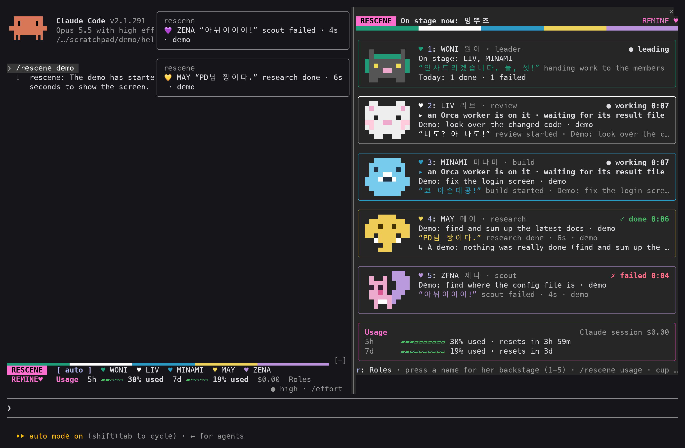
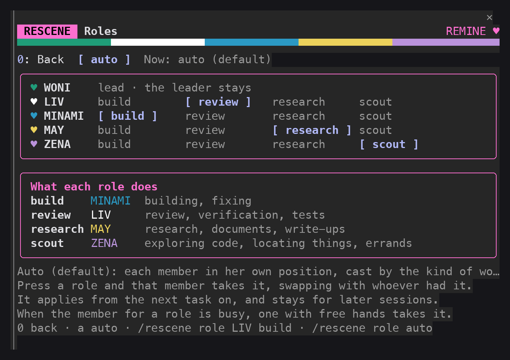

# rescene — RESCENE mode for Claude Code

**English** · [한국어](README.ko.md)

A mod (plugin) for Claude Code in which **WONI of the K-pop group RESCENE conducts, and LIV, MINAMI, MAY and ZENA take the work and report back in their own voices**. A card for each member shows who is doing what right now. It is an unofficial fan mod made by a REMINE (a RESCENE fan). It runs in Korean or English: Korean for a Korean reader, English for anyone else. Version 0.9.1.



Ask WONI something like "have MINAMI fix the README, LIV review the code and MAY look into the docs", and the panel on the right shows the three of them at work. When they are done, WONI gathers the results and reports to you.

> The screenshots are the terminal output of real Claude Code sessions, redrawn character for character and color for color. The one above is the built-in demo (`/rescene demo`) in English; the ones further down that show Korean text were taken in Korean mode. Fonts and colors vary a little by terminal.

## Contents

- [Install (3 minutes)](#install-3-minutes)
- [First steps](#first-steps)
- [Members and roles](#members-and-roles)
- [What you see](#what-you-see)
- [Commands](#commands)
- [Settings](#settings)
- [Language (Korean and English)](#language-korean-and-english)
- [Troubleshooting](#troubleshooting)
- [What this mod does on your machine](#what-this-mod-does-on-your-machine)
- [Having an AI install and use it](#having-an-ai-install-and-use-it)
- [Orca fleet-run integration (optional)](#orca-fleet-run-integration-optional)
- [Development](#development)
- [Notices and sources](#notices-and-sources)

## Install (3 minutes)

### What you need

- **Claude Code**: the program you run as `claude` in a terminal. If you do not have it yet, install it first from the [Claude Code page](https://claude.com/claude-code).
- The mod was built and tested on Claude Code 2.1.291. Check yours with `claude --version`, and bring an old one up to date with `claude update`.
- Nothing else. There is no Node.js or other program to install.

### Installing

1. Open a terminal and run `claude`.
2. Paste this one line into Claude Code's prompt and press Enter.

   ```
   /plugin install rescene --marketplace techkwon/rescene
   ```

3. Answer what the screen asks.
   - `Add marketplace?` → `y`
   - The screen that asks for a scope → press Enter on the first one (user). The mod is then there in every project.
   - The screen that asks for settings → go on as it is unless you want something changed. You can change it later.
4. When it says `Installed rescene. Plugin is now active.`, you are done. It is on at once, with no restart.

### Checking that it is installed

Type `/rescene` in the prompt. The members panel opens on the right and the reply says `The RESCENE members panel is open.`

### Another way (from a copy of the repository)

```
git clone https://github.com/techkwon/rescene.git
claude --plugin-dir ./rescene
```

This loads the mod for that session only. Use it to try the mod without installing it, or to work on it.

### Updating and removing

Run these in a terminal, outside Claude Code.

```
claude plugin update rescene@rescene
claude plugin uninstall rescene@rescene
```

An update takes effect after Claude Code is started again. To turn the mod off for a while, do not remove it: type `/rescene off`, and `/rescene on` to turn it back on.

## First steps

1. **Watch the demo**: type `/rescene demo`. Four make-believe tasks run for about 15 seconds and show how the screen moves. No real work is done and nothing is sent to the model.
2. **Hand out work**: ask as you usually do, and WONI hands the work to members by the kind of work it is. To choose a member yourself, name her.

   ```
   Have LIV review src/index.js, and have MINAMI add a usage section to the README.
   ```

3. **Look closer**: press a member's name in the panel, or type `/rescene minami`, to see what she did, step by step (her backstage).
4. **See your usage**: the card at the bottom of the panel and the band above the prompt show the context left and your plan's limits. For the same in text, `/rescene usage`.

Work handed to members costs tokens for each member. WONI does simple things herself and hands out only what is worth splitting.

## Members and roles

| Member | Heart | Role | What she takes |
|---|---|---|---|
| WONI 원이 (the leader) | 💚 | lead | Splits the work, gathers the results and tells you. This is the main session |
| LIV 리브 (nicknamed 최종병기, "the final weapon") | ♥ | review | Review, verification, tests |
| MINAMI 미나미 (the all-rounder) | 💙 | build | Building, fixing |
| MAY 메이 (nicknamed 메기자) | 💛 | research | Research, documents, write-ups |
| ZENA 제나 (the youngest) | 💜 | scout | Exploring code, locating things, errands |

- The mod casts a task by the kind of work it is. When that member is busy, another with free hands takes it.
- The voice goes **only on the report**. The members are told to keep it out of code, commands, commit messages and file contents.
- LIV's color is black, which a dark screen may not show, so her heart is drawn as ♥.
- The main session's own tool calls (reading, editing, searching, the web and so on) also show on the card of the member whose kind of work they are.
- **The members' lines are real ones, in Korean.** The mod never translates or invents a catchphrase. In English mode the model is given each line with what it means or when it fits, and told to quote it in Korean as she said it.

Who takes which kind of work is yours to change. Press `r: Roles` under the panel, or type `/rescene role`, and the screen below opens. Press a role and that member takes it, swapping with whoever had it. A changed role applies from the next task and stays for later sessions. `auto` puts every member back in her own position.



## What you see

### The panel on the right

Each member's card has a border in her color, a pixel icon, what she is on right now (`▸ Writing: README.md`), her state (`● working`, `✓ done`, `○ idle`) and a line of hers. The icon of a member at work moves, and the card of one at rest is dimmed. The small bar at a card's right is her tool use over the last two minutes or so. Below are the usage card and the stage log, where the members' lines pile up.

With room to spare (50 columns and 37 rows or more) the cards carry icons; with less they are framed cards, and with less still two rows a member.

### Backstage

Press a member's name in the panel (or a number, 1 to 5, when the panel has focus) and it turns to what she has been doing: her task, the first line of her brief, what she is on, her tool calls newest first, and her report once she is done. A call that was refused or failed is marked `Refused:` or `Failed:`. `0`, or her name again, goes back to all five.


### The band above the prompt


- **The row of names** `Send to [ auto ] ♥ WONI lead ♥ LIV review …`: press a name and she takes your prompts from the next one on. The default is **auto** (WONI hands the work out). Press WONI and she does the work herself instead of handing it on. Press the same name again, or auto, to undo.
- **The usage row**: **battery** is how much of this conversation's context window is **left**, and **5h** and **7d** are how much of your plan's limits is **used**. `Roles` at the end opens the roles screen.
- While there is work, a row of the members at work stands above these (hidden while the panel is open). When the terminal is narrow the hint goes first, then the roles, then the bars; at the narrowest only `Send to [ auto ]` is left.

### And more

- **Spinner text**: while you wait it says who is doing what, such as `💚 WONI directing traffic` or `💙 MINAMI Editing: view.tsx`. After a turn comes a line of WONI's (`“우이!”` and the like) and how long it took.
- **Unit names**: one member at work goes by her unit with WONI (우아즈, 원나미, 쪼물딱즈, 맏막즈), two or more by theirs (06즈, 리트와 메트, 메미즈, 막내즈 and others), shown as `On stage now: …`. WONI working alone is `WONI running single-core`. The unit names are the fans' own, and stay in Korean.
- **Lines for the moment**, each said once when its moment comes: at 80% of a limit MAY's “전 총량의 법칙을 믿습니다.”, at 95% WONI's “그냥 굶어라.”, at 80% of the context MAY's “이게 과유불급이에요.”, right after the conversation is summarized WONI's “누구게?”, with four tasks running at once MAY's “여러분 여러분! 너무 시끄러워요!”, when one file is read five times in a turn WONI's “와 이래 많이 봅니까, 우리? 그만 좀 봅시다.”, and when a task of ZENA's passes three minutes WONI's “너 김가영이야?”
- **The quote cup**: the line said most this session stands first above the stage log. `/rescene cup` gives the whole ranking.
- **Light and dark screens**: when the name of your Claude Code theme has `light` in it, the mod draws in deeper colors that read on a light background. A changed theme is followed from your next prompt. Where that is not right, set "Screen brightness" to `light` or `dark`.


## Commands

| You type | What it does |
|---|---|
| `/rescene` | Opens the members panel |
| `/rescene demo` | Runs four make-believe tasks for about 15 seconds to show the screen. No real work is done |
| `/rescene on` · `/rescene off` | Turns the mode on and off. Off, the voice instructions and the drawings stop |
| `/rescene usage` | Your usage in text: context, limits, cost, tokens by member |
| `/rescene cup` | The quote cup: the lines said most this session |
| `/rescene liv` (a member's name) | Opens her backstage. `/rescene all` goes back to all five |
| `/rescene to minami` | Your prompts go to her from the next one on. `/rescene to woni` has WONI do the work herself, and `/rescene to auto` undoes it (the default) |
| `/rescene role` | Opens the roles screen |
| `/rescene role liv build` | Gives LIV the build work, in exchange with the member who had it. Roles: build · review · research · scout |
| `/rescene role auto` | Puts the roles back to auto (the default) |
| `/rescene lang` | Says which language is in use and how to change it |
| `/rescene lang en` · `ko` · `auto` | Changes the language of the screens and the instructions, or gives it back to auto. A language you pick stays for later sessions |
| `/rescene clear` | Clears the record of finished tasks, the stage log and the quote cup. Tasks under way and the tokens counted by member stay |

Names and roles may be typed in either language: `/rescene 리브`, `/rescene role 리브 구현` and `/rescene to 자동` work as well.

A member you picked also takes a slash command that carries a request, such as `/goal fix the button`. She does not take a command that only sets something up, such as `/model`, `/compact` or `/voice`. The two are told apart by a list of command names, so a new setup command that is not on the list may get the note about the pick (it is only text for the model, and changes nothing about what the command does).

## Settings

You choose these on the screen that asks at install time, and change them later by typing `/plugin configure rescene@rescene` in the prompt.

| Key | Name | Default | What it does |
|---|---|---|---|
| `leaderVoice` | WONI's voice | on | The main session speaks as WONI, the leader |
| `memberVoice` | Members' voice | on | A subagent reports in the voice of the member it was cast as |
| `language` | Language | `auto` | Write the value as text. `auto` (Korean for a Korean reader, English for anyone else) · `ko` · `en`. Within a session, `/rescene lang` changes it |
| `band` | Band above the prompt | on | Shows who takes the next prompt and your usage, and the members at work while there is work |
| `bandStyle` | Shape of the band | `full` | Write the value as text. `full` (a color rule, each member with her heart and role, usage bars) · `compact` (one row at rest, two at work) |
| `autoOpen` | Open the panel by itself | on | Opens the panel when work is handed to a member (where the terminal is 144 columns or wider). Closed by hand, it stays closed until `/rescene` |
| `theme` | Screen brightness | `auto` | Write the value as text. `auto` (follows the Claude Code theme) · `dark` · `light` |
| `orcaVoice` | Orca workers' voice | on | Hands a `fleet-run` worker a copy of its spec with the member's voice block at its end (only where you use Orca) |
| `keepScreen` | Keep an Orca worker's screen | **off** | Adds `tee` after a one-step `fleet-run` so `<out>.live.log` is kept. Off by default, because it changes your command |

## Language (Korean and English)

The default is **auto**: Korean for a Korean reader, English for anyone else.

- **Auto takes the reader for Korean when** (the first that applies decides)
  1. Claude Code has an answer language set (`language`, not left at its default): Korean if it names Korean (`Korean`, `ko`, `한국어` and the like), English if it names any other
  2. one of the environment variables `LC_ALL`, `LC_MESSAGES`, `LANG` starts with `ko`
  3. the runtime's locale is `ko`
  4. the time zone is `Asia/Seoul`

  Otherwise it is English. A session that auto began in English turns Korean at the first prompt written in Korean, and a toast says so with the way back (`/rescene lang en`). A prompt counts as Korean when, members' names aside, it has more Hangul syllables than English words: a Korean word quoted in an English sentence does not.
- **Changing it yourself**: `/rescene lang en`, `/rescene lang ko`, `/rescene lang auto`. A language picked by command stays for later sessions and has the last word over the `language` setting. `auto` goes back to the setting, or to the signs above where the setting says `auto`.
- **What English changes**: the panel, the band, the toasts, the command replies and the instructions given to the model. Members go by WONI, LIV, MINAMI, MAY and ZENA, and roles by lead, build, review, research and scout.
- **What it does not change**: the members' lines. They are what the members really said, so they stay in Korean, and the model is told what each means or when it fits instead of being handed a translation to quote. Unit names (06즈 and the like) stay as they are too.
- This is the language of **what the mod writes**. It does not decide what language the model answers in: the model follows your language and Claude Code's own instructions.
- What was already on the screen before a change (a note in the stage log, say) stays in the language it was written in.

## Troubleshooting

| What you see | What to try |
|---|---|
| `/plugin install …` is not available | That line works only in **Claude Code run in a terminal**, not in the desktop app's Code tab. Installed once from a terminal (user scope), the mod loads in the desktop app as well |
| The marketplace is not found | Check that the address is `techkwon/rescene` |
| There is no `/rescene` | The mod is not installed, or is disabled. In a terminal, see whether `claude plugin list` has `rescene`. If Claude Code is old, `claude update` |
| The panel does not open by itself | It does not where the terminal is narrower than 144 columns. Type `/rescene` and it opens at any width |
| No icons, only cards of text | That is how a small panel looks. Make the terminal window bigger (37 rows or more for the panel) for the icon cards |
| The colors are faint or hard to read | Set "Screen brightness" to `light` or `dark` to match your theme |
| The screens are in Korean (or in English) | `/rescene lang en` (or `ko`). It stays for later sessions |
| The voice gets in the way of work | Turn the mod off with `/rescene off`, or turn off only `leaderVoice` and `memberVoice` in the settings (the screens stay) |
| The band above the prompt takes too much room | Set "Shape of the band" to `compact`, or turn `band` off to be rid of it |

If none of that helps, run `claude --debug` and paste the lines that begin with `rescene:` into an [issue](https://github.com/techkwon/rescene/issues). Please take out anything personal and any key first.

## What this mod does on your machine

A mod runs with your own permissions, not in a sandbox. So here is everything it reads, runs, writes and changes.

- **Sends nothing.** There are no network calls. The two programs below are run only to read text back on the same machine.
- **Reads**: the first line of each prompt, each tool call's name and target (a file name, the start of a command), the opening of a subagent's report, usage figures and the name of the Claude Code theme, all to draw the session's own panel and band. Of the environment it reads five variables: `HOME` (to resolve `~` in a command), `SHELL` (to know whether the shell is zsh or bash), and `LC_ALL`, `LC_MESSAGES` and `LANG` (to tell whether the reader is Korean). For that same question it also reads the answer language set in Claude Code and the runtime's locale and time zone. It reads no credential or key.
- **Runs two programs**, both for the optional Orca integration:
  - `orca terminal read --terminal <handle> --screen`, to read the screen of a worker tab you opened in Orca. When `orca` is not on the path it runs `/Applications/Orca.app/Contents/Resources/bin/orca`.
  - `tail -c 16000 <out>.live.log`, to read only the end of a long progress log kept when `keepScreen` is on.
- **Writes one kind of file**: beside an Orca `fleet-run` spec, a copy named `<name>.rescene-<member>.md` with the member's voice instructions appended, which the other AI worker reads as its instructions. The original is left alone, and nothing is written with `orcaVoice` off. Besides that, the role settings and a language picked with `/rescene lang` are kept in Claude Code's plugin store.
- **Changes**
  - It adds one section, "RESCENE mode", to the system prompt (`prompt.compose`), and adds a note to a prompt when you have picked a member or changed the roles, the language or the mode (`prompt.submit`).
  - It appends a member block to the prompt a subagent is given (`agent.spawn`), and adds one line naming the member to an Agent tool's result (`tool.call`).
  - It draws the spinner text, the line after a turn, the band above the prompt and its own panel (`ui.render`).
  - It rewrites a Bash command in two cases only: the `--spec` path of a `fleet-run` is pointed at the copy above (`orcaVoice`), and with `keepScreen` on a one-step `fleet-run` is piped through `tee`. Every other tool input goes through as it is.
  - It takes no permission decision: it never allows or denies a tool call, it only looks at the result. It hooks no setting as it is made (the theme's name is read when a prompt is sent).
  - It registers one command, `/rescene`, and no tools or agents.

## Having an AI install and use it

Give an AI coding tool such as Claude Code this repository's address and ask:

```
Read AGENTS.md at https://github.com/techkwon/rescene and install the rescene mod.
```

[AGENTS.md](AGENTS.md) is written for an AI to read: the install commands, how to check the install, how to hand work to members in a session with the mode on, and the rules for changing this repository's code.

## Orca fleet-run integration (optional)

This part is for people who launch other AI workers (Codex, Grok and so on) from Orca with `fleet-run <profile> --spec <file> --out <file>`. If you do not use Orca you can skip it: the mod works the same without Orca.

- A worker is cast by what its profile is for (build, review, research, scout). A general profile such as `codex-hard` is cast by the name of its spec file (LIV when it has `audit`, `review` or `점검` in it).
- Only a `fleet-run` where the shell really runs it counts. The name inside text handed to `grep` or `echo`, in a comment or in a script's body is not a task.
- The original spec is left alone. A copy with the member's voice block at its end (`<name>.rescene-<member>.md`) is made in the same folder and the worker is run from that copy (not with `orcaVoice` off).
- The `<out>.meta.json` a worker leaves as it ends tells the card whether it succeeded, its model, the time it took and its tokens. Where the result file's path could not be read, the task stays "waiting" and you are told to check for yourself.
- **What a worker is on right now**: when the command is one `orca terminal create … --command "… fleet-run …"` and nothing else (a filter such as `| grep …` at its end is fine), the mod runs `orca terminal read --screen` with the terminal handle that command printed, and every six seconds shows the last step on the worker's screen on her card and in her backstage. Your command is not changed. With other steps mixed in, with the output sent elsewhere, or with more than one handle printed so that it cannot be sure whose terminal answered, the screen is not read.
- When the screen cannot be read twice running, what the card says she is on is taken down, her backstage says `unreadable now · as last read`, and the reads are spaced out to at most a minute.
- When the command that opens the terminal (that alone, with no filter) fails, the task is closed as failed at once. A failure of a command with a filter may be the filter's, so the result file is still waited for.
- A `fleet-run …` run straight, with no Orca tab, has no screen to show: only its result file is waited for. To see its screen all the same, turn on `keepScreen`. Then, when the command is one `fleet-run …` and the shell is zsh or bash, the command is run as `fleet-run … 2>&1 | { tee '<out>.live.log' 2>/dev/null || cat; }; (exit "${PIPESTATUS[0]:-${pipestatus[1]}}")`. The exit code and the arguments are the same (tested in zsh and bash), but standard error is joined to standard output, and where `fleet-run` is a shell function, the shell variables and the current folder it changes do not last.
- The voice copies and `.live.log` files stay beside the spec and result files. The mod does not delete them: you may, once the work is done.

## Development

```
git clone https://github.com/techkwon/rescene.git
cd rescene
claude --plugin-dir .
```

This runs Claude Code with the mod loaded. Once it has loaded, Claude Code lays the type files in `.claude-plugin/types/` (they are not in the repository). Then run the checks.

```
tsc -p . --noUnusedLocals
claude plugin validate .
claude plugin test .
```

| Path | What it holds |
|---|---|
| `.claude-plugin/plugin.json` | Name, version, settings |
| `.claude-plugin/marketplace.json` | What makes this repository an install address |
| `hooks/register.tsx` | Every hook: casting, voice instructions, the command, usage, the Orca integration |
| `hooks/view.tsx` | The panel, the band, the backstage, the roles screen |
| `hooks/lang.ts` | Picking the language (Korean or English) and telling who reads Korean |
| `hooks/members.ts` · `voice.ts` · `action.ts` · `orca.ts` · `sprites.ts` | Members and lines, the voice texts, the phrase for each tool, reading shell commands, the pixel icons |
| `types/index.d.ts` | The contract for the session's state |
| `tests/` | 115 tests |

The rules for changing the code are in [AGENTS.md](AGENTS.md).

## Notices and sources

- This is an **unofficial** mod made by a fan. It has nothing to do with THE MUZE Entertainment, and uses no official logo, photo or remini drawing. The pixel icons were drawn for this mod.
- The members' details (colors, hearts, nicknames, unit names) and lines come from Namuwiki (read 2026-10-06). Namuwiki is a wiki written by fans, not an official source. Only lines on record as really said are used, and no catchphrase is made up. "미음" and its twists (미으무야~, 망했또띠, 망해또르띠아) are the members' own slang for "we're done for", and "이봐협에서 나왔습니다." is a meme among REMINE. Only WONI's "오이쉬!" is spelled the way the maker chose rather than as recorded ("오이쉬에~").
- The mod uses the first line of a prompt, the record of tool use and the usage figures **only on that session's screen**. No code sends anything out. What it leaves on disk is the role settings and a picked language (in Claude Code's plugin store) and, where you use Orca, the voice copies and `.live.log` files.
- Real mouse clicks and the light theme were checked by automated tests only. If something looks wrong, please open an issue.
- The code is under the [MIT License](LICENSE). The rights to the members' names and lines belong to their holders.
